In this six week first round design iteration, I worked as concept developer, UX designer and researcher during the process, from sketching to Mid-Fi prototype to usability test and to the first design iteration.

  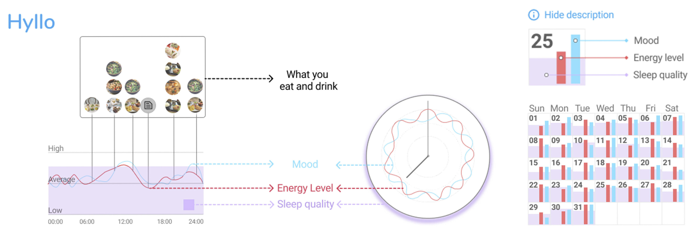

# 1 Introduction of Hyllo

Hyllo is an app that helps you observe *patterns* between fundamental aspects of your life and your overall health, then make improvements based on your personal evidence.

**Challenge:** design an app that can let people observe the fluctuation of their states and find out how that relates to their basic life style in a non-stressful way.

**Solution:** Hyllo allows users record their diet and sleep quality as well as their energy level and mood in a effortless way, and draw insights from these data with graphes over different time scales, then make improvements based on these personal evidence.

# 2 Hypothesis
  The rise of wearable equipments allow us to collect more and more data about our body,
  then a lot of health suggestions are produced, people are told how to live in a "dataly correct" way.

  But more of the situation is we are getting more stress instead of benefits.
  People need a wise *step back* to observe their life in a simple, non-stressful and holistic way, and live an individually feeling-right way, not a should-be-right way.

  The first step for any improvements is observation. And a good but often ignored starting point is tending the basic aspects of life, physically and mentally.

# 3 Ideation and design

The idea isn't clear at first. By constantly asking different questions and collecting thoughts from various places, a few key questions came in.

<figure>
    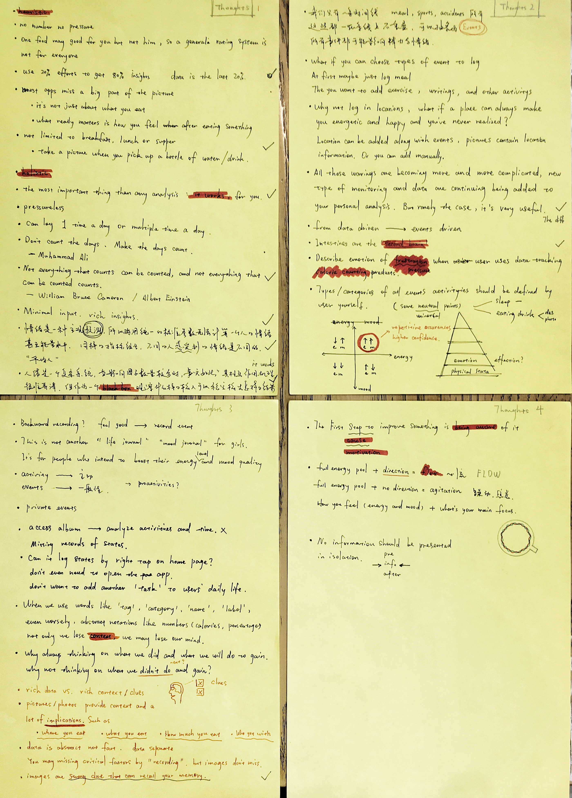
    <figcaption>Thought Fragments</figcaption>
</figure>

**Key questions:**
  - What are the most basic aspects of life for everyone
  - how to address the body-mind connection
  - what's the frictionally minimal way facilitating a long term use

**Answering/designing**

Data that will be collected:
  - feelings about users' energy level and mood
  - a few basic aspcect of life, in this version only diet and sleep quality are included

Those are the most basic things about one's everyday life. Synthesizing all
the data with different time scales enables us to see how our
basic life style can influence our energy level and mood. And how our body and
mind are closely bound to each other -- it's almost impossible to have a bad
mood when you feel energetic and vice versa.

### Sketchings

**The main flow:** The clock pad provides a visual representation of the fluctuation of one's energy and mood within a day; energy level and mood are input via slidebars; a meal entry can be recorded by photos and notes.

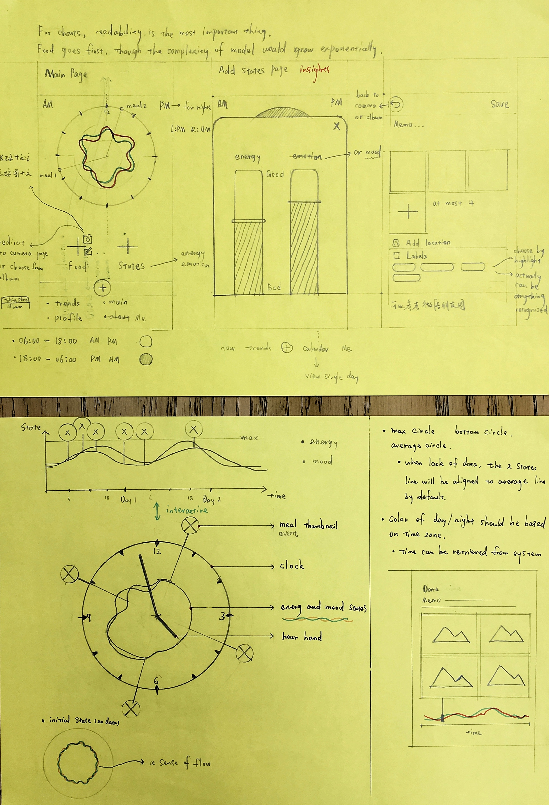

 

**Patterns and Insights**: The purpose of collecting all these data is to draw insights about how one's basic life style influences their physical and mental states.

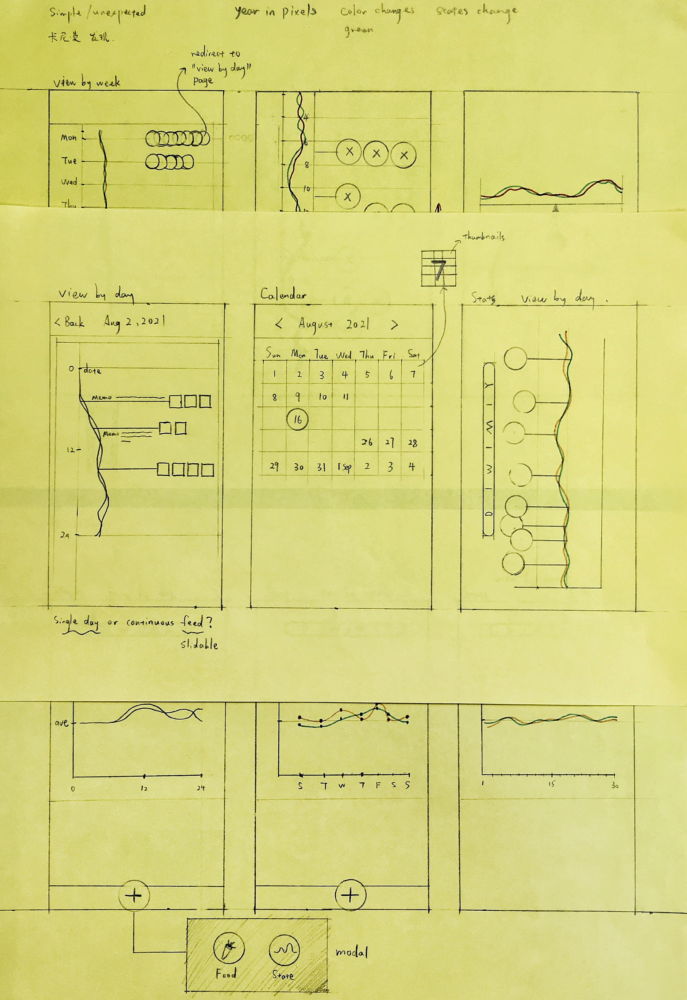

If an positive/negative pattern emerges repeatedly, then we can do something to reinforce/diminish that pattern, for example if eating something always makes your feel replenished/drowsy then you may choose to keep/avoid eating that, and that decision is not a guesswork, it's based on your individual evidence.

### An overview of the mid-fi prototype

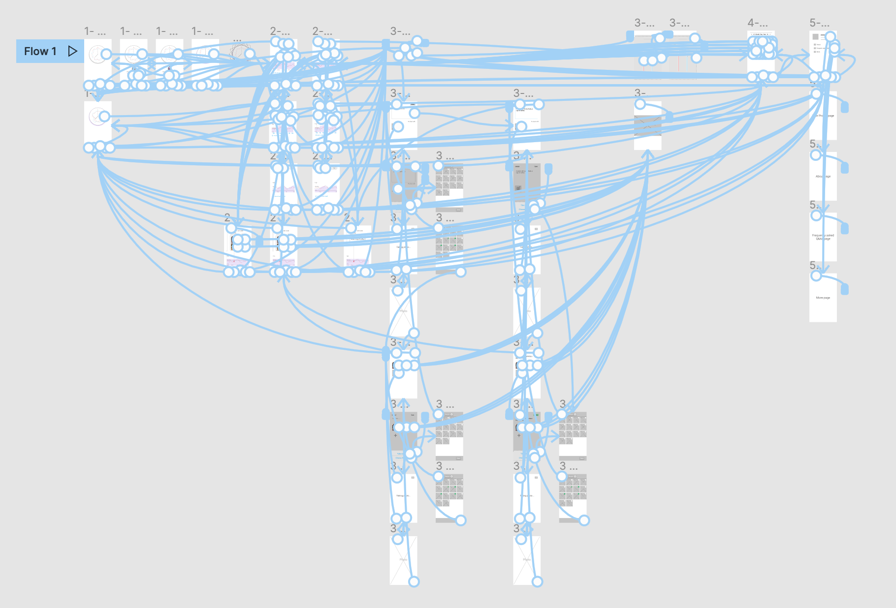

# 4 Test and research

### Methodology & participants
20 participants were recruited via a test service [maze](https://app.maze.co/) to finish a usability test on the mid-fi prototype. They were asked to finish a series of missions using the interactive prototype of Hyllo and then to answer various questions based on their experience.

- [The original Maze test link](https://t.maze.co/51572533)
- [The complete Research report](https://1drv.ms/p/s!Apq2PZcP-VGpiwbMxeTKqD6bntwV?e=UdWvg3)

### Usability Test

Participants were asked to complete missions like entering a meal, sleep quality, a state entry, and checking insights drawn from their data. Each mission corresponds to a main feature of Hyllo. Upon completing each, they also needed to answer a few questions around the product. Questions were in different types like single/multiple choice, open questions, ratings etc.

  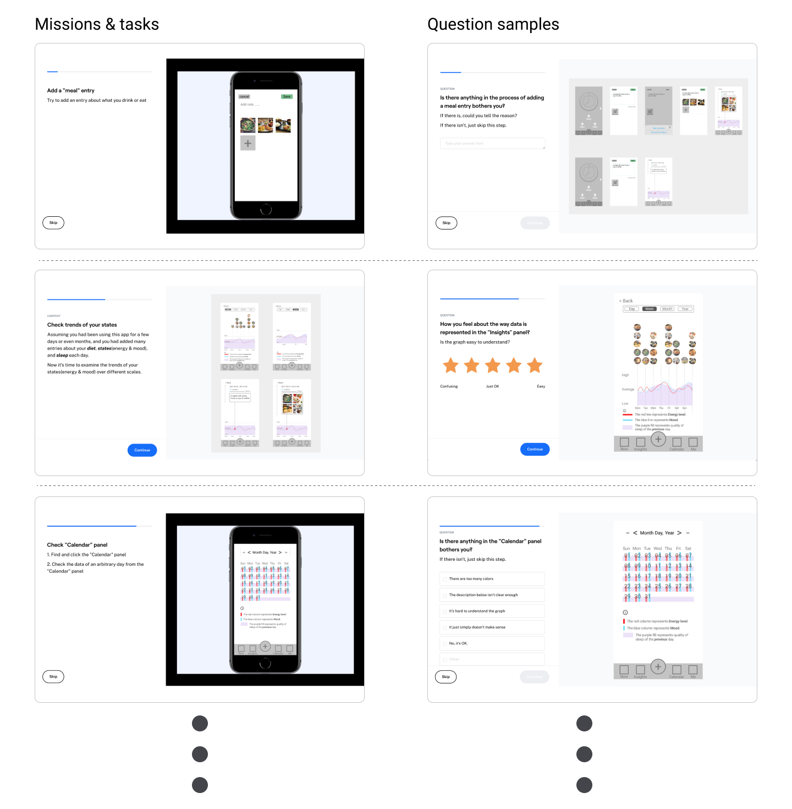

### Research and study

Affinity groups was used to analyze the test results. Grouping work was approached from different perspectives to draw insights from fresh views.

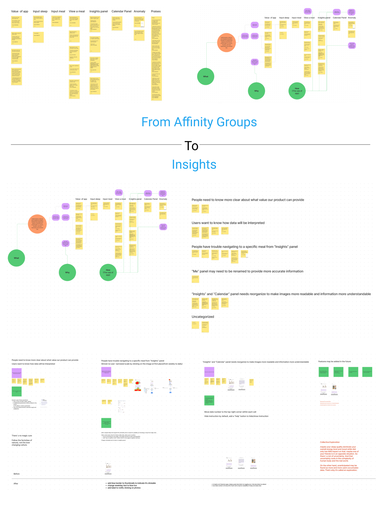

---

### Findings and insights

The test results far exceeded my expectation, most participants agreed on the product idea and they also gave many valuable feedback.

**More signifiers:** Switching between different time scales is a subtle task in Hyllo. From month to week to day to a certain moment, this logic sequence can be integrated into the graph system. I tried to do this without adding too much signifiers, but it may not be so clear to new users.

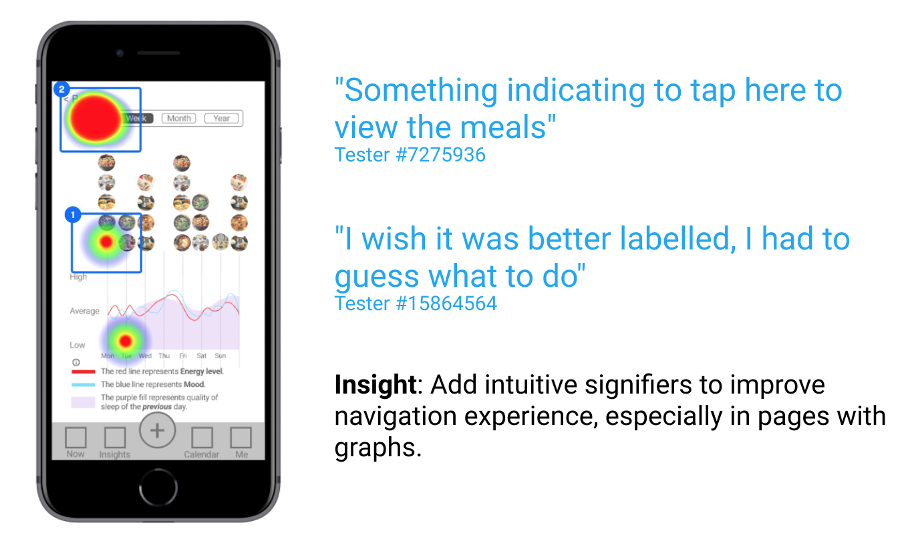

---

**Clean graphs:** Graphs are at the core of Hyllo. It's the most important and maybe the only way to show audience the pattern visually. So it's vital to keep graphs clean, simple, and understandable.

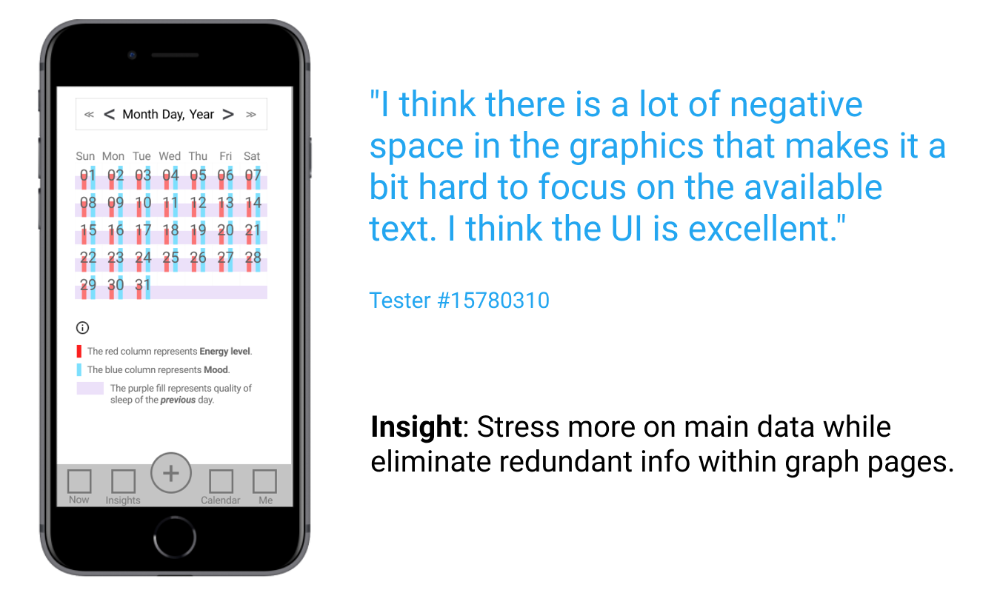

---

**Product value and scopes:** The "wise step back" implies many things. Hyllo stresses individual feelings over health suggestions. That doesn't mean we should abandon all health suggestions. What if a 5-hour sleep can make you energetic and a 6-hour cannot, what if eating 2 meals a day let you feel much better than 3 meals a day?

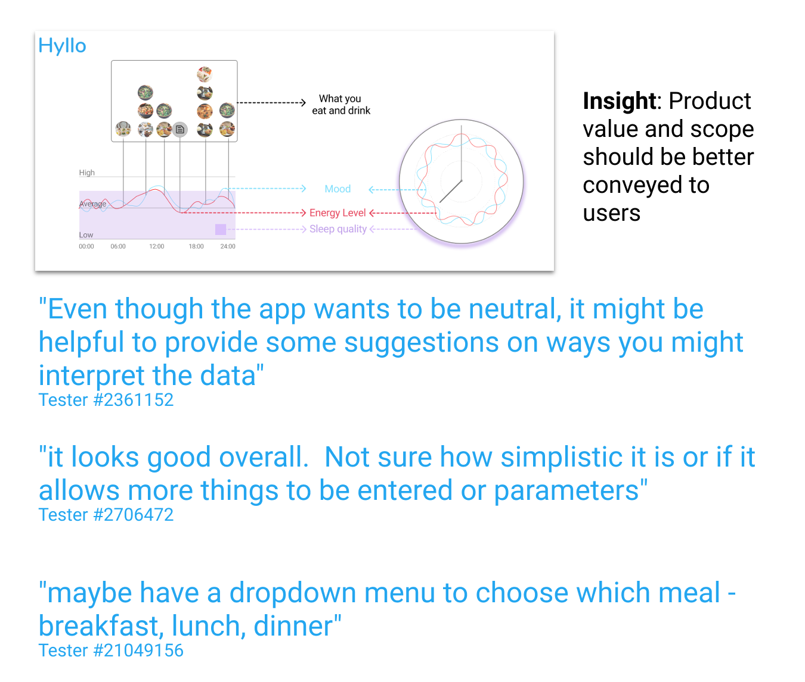

We are unconsciously following a lot of culture-based living standards, and some of them may not be optimal to a unique individual.

**Expectations from users**

Many participants had an empathy on the product idea. They need a convenient tool to observe their life in a holistic and heuristic way, but they don't need another chore nor more stress for their already stressful life.

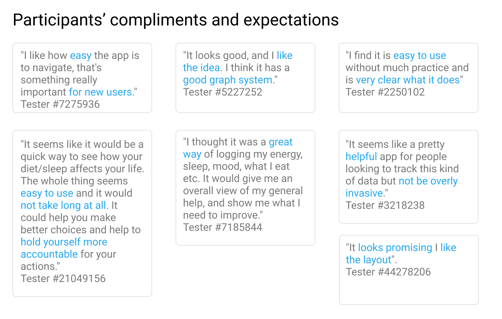

# 5 First round design iteration

A few changes were made based on insights drawn from the first round of usability test.

**More signifiers:** use color and text to signify clickable elements on the page, so that users can easily figure out how to switch between different time scales.

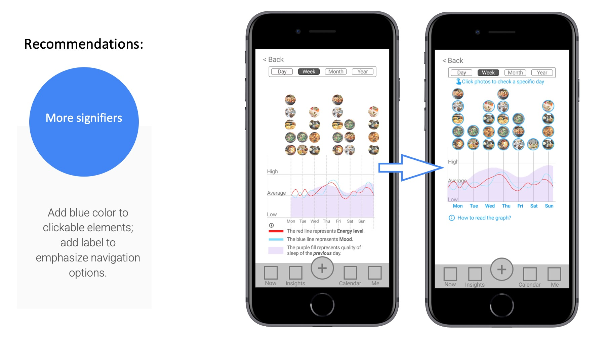

**Clean graphs:** Instructions are hidden by default and elements within calendar cells are rearranged to make data easier to read.

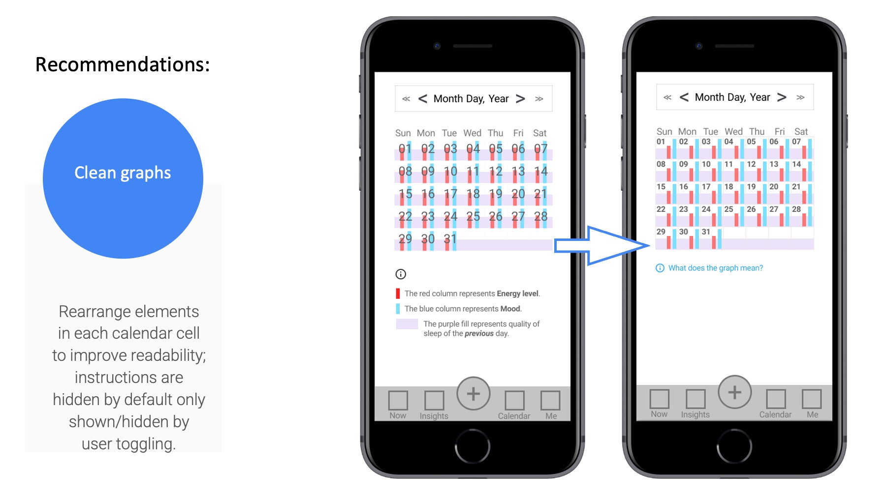

Adjustment on calendar cell.

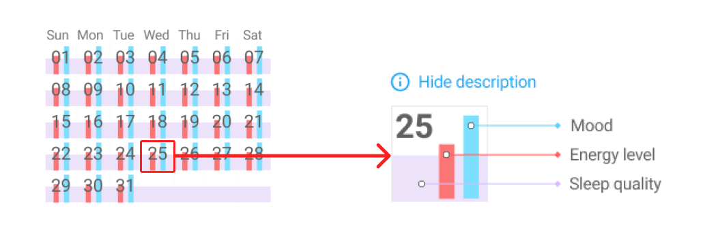

**Product value and scopes:** Some participants asked about if they need to know how many hours they slept or if they are allowed to add other parameters and how to label each meal as breakfast, lunch and supper etc.

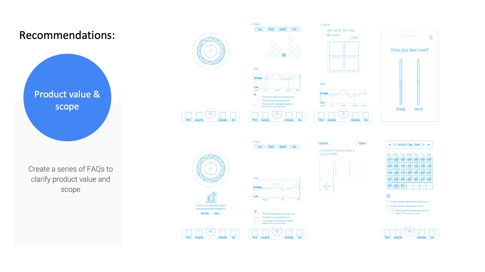

Hyllo wants to break some culture-based preconceptions about our daily life. This comes with time and communication. So more explanation on the unique value Hyllo adds is necessary.

# 6 Next steps

**High-fidelity prototype:** After first round of usability test and design iteration, it's more confident to work on a Hi-Fi version. Insights can be addressed more through a thorough design process, and new idea may pop out along the way.

**New features:** The definition of "the most fundamental aspects of life" is not easy to scope. Should we take exercise into account? What about naps? May or may not. There's more to explore.

**Collective exploration:** The answers to some questions about Hyllo are not a simple yes or no. They may be answered by more tests, communication, and discussions with users. It's a collective exploration rather than a pure design process.

